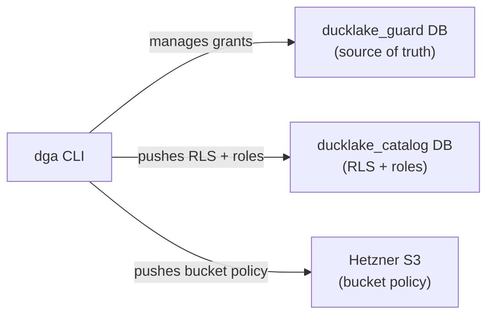

# `ducklake-guard`

Per-table access control for [DuckLake](https://ducklake.select) lakehouses on Hetzner Cloud. A single CLI manages S3 bucket policies, Postgres catalog visibility (RLS), and catalog roles, with an audit log.

[!NOTE] I'll add AWS and Scaleway, make sure to follow the repo for any updates.

## System overview



## Prerequisites

- Hetzner server, PostgreSQL, Object Storage bucket. Recommendation, auto deploy with [`ducklake-hetzner`](https://github.com/berndsen-io/ducklake-hetzner).
- S3 credentials for each user, created manually in the Hetzner Console (no API exists for credential lifecycle)
- SSH access to the PostgreSQL server (for `dga init`)

## Quick start

```bash
cp .env.sample .env
# Fill in credentials

dga init                          # create guard DB, schema, enable RLS

dga user create tim \
  --access-key <KEY> \
  --project-id <PID>              # register user, create catalog role

dga allow tim --table customer --read-only
dga allow tim --table orders --read-write

duckdb -init init-tim.sql         # verify: SHOW TABLES, SELECT, INSERT

dga deny tim --table orders       # revoke access
dga user delete tim               # remove user, scrub policies, drop role
```

## CLI quick reference

| Command | Description |
|---|---|
| `dga init` | Create guard DB, schema, pg_hba, enable RLS |
| `dga user create <name>` | Register user + S3 creds, create catalog role |
| `dga user delete <name>` | Remove user, scrub policies, drop role |
| `dga allow <user> --table T` | Grant read-only or read-write access |
| `dga deny <user> --table T` | Revoke table access |
| `dga sync` | Converge S3 + RLS to match grant state |

## Documentation

- [Architecture](docs/architecture.md): enforcement layers, transaction flow, sync convergence, module dependencies
- [Usage](docs/usage.md): setup, user management, granting and revoking access, DuckDB verification
- [Schema](docs/schema.md): database tables, generated columns, composite keys
- [Design decisions](docs/design-decisions.md): why separate Hetzner projects, RLS limitations, policy size bundling
- [Development](docs/development.md): running tests, linting, pre-commit checklist
