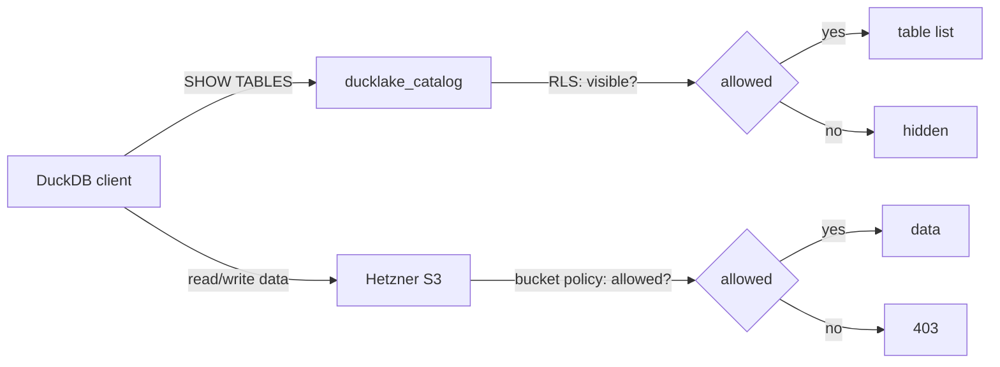
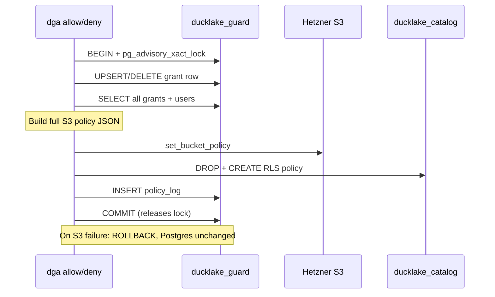
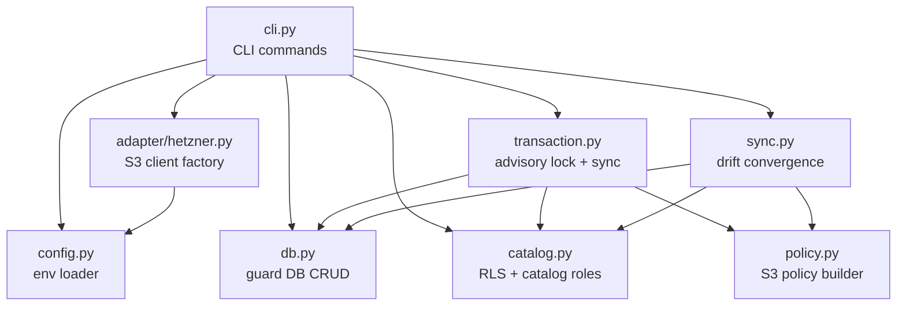

# Architecture

ducklake-guard enforces per-table access at two layers: S3 bucket policies block data reads and writes, and Postgres RLS hides table metadata from `SHOW TABLES`. A third component, the catalog role, gives each user a dedicated Postgres login for DuckDB connections. All three layers are derived from a single source of truth in the `ducklake_guard` database.

## Enforcement layers

When a DuckDB client connects, two checks happen independently:

Each DuckLake table lives under an S3 prefix (`main/<table>/*`). ducklake-guard manages three things per user:

1. **S3 bucket policy.** Allow statements scoped to specific table prefixes, either read-only or read-write.
2. **Catalog RLS.** Row-Level Security on `ducklake_table` so `SHOW TABLES` only reveals granted tables.
3. **Catalog role.** A Postgres role (`dga_<user>`) in `ducklake_catalog` that the user connects with via DuckDB.

S3 is the real security boundary. RLS is cosmetic: it hides table names from `SHOW TABLES`, but other metadata tables (`ducklake_column`, `ducklake_data_file`) are not filtered, so table names can be inferred. A user without an S3 grant still gets a 403 on data access regardless of what they can see in the catalog. This will be addressed in a future iteration.

## Transaction flow

Every `allow`, `deny`, `user create`, and `user delete` follows this sequence:

The advisory lock serializes all mutations. Concurrent CLI instances wait their turn. S3 and RLS are pushed inside the open transaction, so if S3 fails, Postgres rolls back cleanly.

The common failure mode (S3 or RLS push fails) leaves Postgres unchanged. The rare failure (commit fails after S3/RLS success) leaves S3 or RLS ahead of Postgres. Running `dga sync` converges everything back.

## Sync convergence

`dga sync` reads all grants from Postgres and rebuilds both S3 and RLS to match. No surgical patching. Full replace, always.

For S3: build the desired policy from all active grants, fetch the current policy from the bucket, normalize both (sort statements by Sid, sort array values), and compare. If they differ, push the desired policy. If no grants exist, delete the bucket policy entirely (S3 rejects empty statement lists).

For RLS: for each user, build the desired `USING` clause from their grants, compare against the current RLS policy in `pg_policies`, and `DROP` + `CREATE` if they differ. Users with no grants get their RLS policy dropped (RLS deny-by-default hides all tables).

Use `dga sync` after manual bucket policy edits, failed RLS pushes, or any situation where the three systems may have drifted.

## Module dependencies

`policy.py` is a pure function with no I/O. It takes grant and user data as plain dicts, returns a policy JSON dict.
