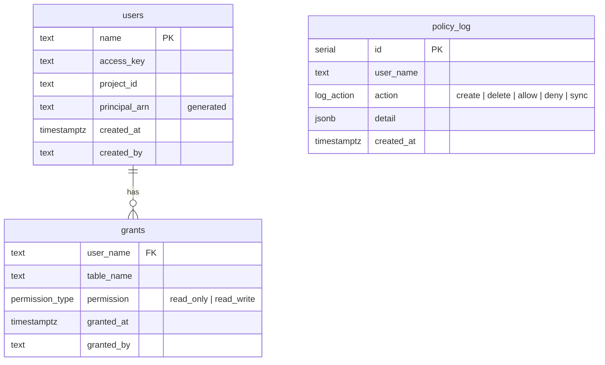

# Database schema

The `ducklake_guard` database stores users, their table grants, and an append-only policy log. It lives on the same PostgreSQL server as `ducklake_catalog`.

## Tables

### `users`

One row per managed user. The `access_key` and `project_id` come from the Hetzner Console when you create the S3 credential.

`principal_arn` is a generated column: `arn:aws:iam:::user/p<project_id>:<access_key>`. It is never set directly. The S3 policy builder reads it to construct `Principal` blocks in bucket policy statements.

### `grants`

One row per user-table pair. The composite primary key `(user_name, table_name)` enforces exactly one permission level per table per user. Running `dga allow` on an existing grant UPSERTs the permission.

`permission` uses the `permission_type` ENUM (`read_only`, `read_write`). Grants cascade on user deletion.

### `policy_log`

Append-only audit trail. Every mutation (allow, deny, create, delete, sync) inserts a row with the action name and a JSONB detail blob. Useful for debugging drift or understanding what changed and when.

The schema is designed to bridge toward compliance frameworks like SOC 2 and GDPR. Timestamped, append-only, action-typed rows with structured JSONB detail provide the foundation for a formal audit log. Adding operator identity, retention policies, or external log shipping would be further required to get closer to a fully compliant setup.

## Reference SQL

The full schema definition is in [`src/ducklake_guard/templates.py`](../src/ducklake_guard/templates.py) as `SERVER_INIT_SQL`.
